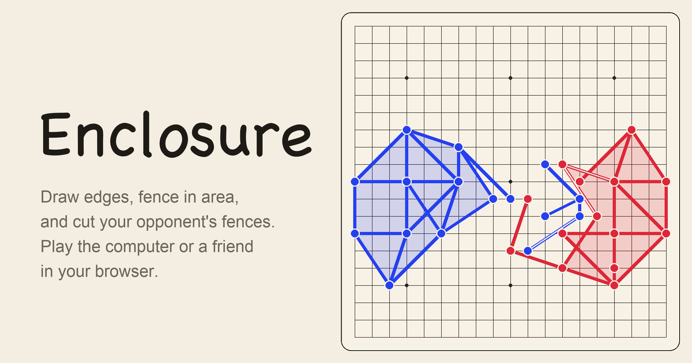

# Enclosure

A browser version of Enclosure, a strategy game on a 19 by 19 grid. You grow a drawing of edges, fence in area, and cut your opponent's edges. Every turn you score the area you hold. After 120 edges, the higher score wins.

**Play it here: https://prathammukewar.github.io/enclosure/**



## What you can do

**Play**
- Against the computer on Easy, Medium, Hard or Expert, or on Adaptive, which plays harder when it's behind. Pick a style too: balanced, a careful builder, a raider that goes after your walls, or a gambler.
- With friends on one screen, with any mix of people and computer players.
- Online by sending a link. Up to four players, empty seats can go to the computer, and anyone can watch with a second link. If someone reloads the page, they get their seat back.
- By link, at your own pace: after your turn you send a link, the other player opens it, plays and sends one back. You can set a time limit per turn.
- With three or four players, or two teams of two, on a smaller 13 by 13 board, with fewer edges, a different reach, no protection, border walls or handicap edges.
- With a clock, including the 1 minute plus 15 seconds setting used in tournament play.
- In a double-elimination tournament run on one screen, the way the Strategy Jam ran.

**Get better**
- Eleven short interactive lessons, the full rules with diagrams, and a strategy guide with positions to try.
- Puzzles of five kinds: the best turn, the most area you can fence in, the most you can cut, blocking the opponent's best cut, and planning four edges ahead. There's a puzzle of the day, a calendar of past days, Puzzle Rush, and puzzles you make yourself.
- A report after each game that grades every turn against the best possible turn, and saves your big misses as puzzles.
- An analysis board: set up any position, ask for the best turn or the computer's choice, share it, or play on from it.
- While you play: a preview of what each edge will do, hints, undo, the computer's reasons for its last turn, and overlays for weak walls, reach, risk and the opponent's best cut.

**Everything else**
- Profiles with ratings, game history, stats and achievements, kept in your browser, with backup and restore.
- Replays as links, pictures, GIFs or videos.
- Paper, night and high-contrast looks, your own player colors, a colorblind-friendly set, shapes and patterns, thicker lines, zoom and a magnifier on touch screens, keyboard play and a text description of the board.
- Installs as an app and works offline.

## The rules in short

- Blue starts with an edge from a10 to d10 and Red with one from s10 to p10.
- Blue places one edge, then players take turns placing two. The game lasts exactly 120 edges.
- A new edge starts at one of your nodes and ends anywhere within 3 points across and 3 points up or down.
- If it touches an enemy edge, that edge breaks, along with any of their nodes left with no edges. An edge can break only one enemy edge, and edges placed on the opponent's last turn are protected.
- You can't end an edge on the middle of your own edge, or pass through your own node.
- After every turn, both players add the area their edges enclose to their score.

The [rules page](https://prathammukewar.github.io/enclosure/#rules) has the details and the answers to common questions.

## How it's built

Plain HTML, CSS and JavaScript modules, with no build step and no dependencies apart from PeerJS for online games. The [How it works](https://prathammukewar.github.io/enclosure/#about) page explains the interesting parts.

| File | What it does |
| --- | --- |
| `js/engine.js` | The rules for every variant: legal edges, breaking, protection, turns, teams, scoring, timeouts, and the compact codes used in links |
| `js/geometry.js` | Exact contact tests on lattice segments, and enclosed area from the planar arrangement of a player's edges |
| `js/ai.js` | The computer player. It plans a whole turn and judges it by score, area, what the opponent can break next turn and how exposed each cell is. It runs in a Web Worker. |
| `js/solver.js` | The exact best turn, used by reports, the analysis board and the puzzle tools |
| `js/board.js` | The SVG board: previews, overlays, zoom, touch, keyboard |
| `js/play.js` | The play screen |
| `js/online.js`, `js/corr.js` | Online games over WebRTC, and games by link |
| `js/puzzles.js`, `js/puzzledata.js` | Puzzles, mined with `tools/mine.mjs` |
| `js/lessons.js`, `js/guidecontent.js` | Lessons and the strategy guide |
| `js/profile.js`, `js/tournament.js`, `js/report.js`, `js/analysis.js` | Profiles, tournaments, game reports and the analysis board |

## Running it locally

```bash
python3 -m http.server 8000
```

Then open http://localhost:8000. Any static file server works.

Tests:

```bash
node test/test.mjs
```

The tests check the rules against an independent, slower implementation on thousands of random moves in every variant, and check every area against a second area method based on vertical slabs. `node tools/check-ids.mjs` checks the page has every element the scripts use, and `test/ui.html` opens every screen in a frame and checks it for errors.

Tools:

- `node tools/arena.mjs hard medium 40` plays computer-against-computer matches.
- `node tools/mine.mjs 20 > mined.json`, then `node tools/verify-puzzles.mjs mined.json > verified.json` and `node tools/build-puzzles.mjs verified.json` make new puzzles. The verifier checks every answer on the rules engine alone.
- `node tools/book.mjs` rebuilds the opening book.

## About

This is an unofficial fan-made version of the game, built from the rules shown in its reveal video. It isn't affiliated with the game's creator or its official site.

## License

MIT
